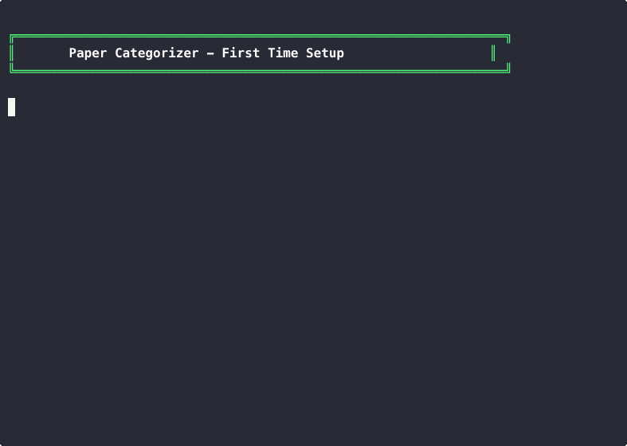
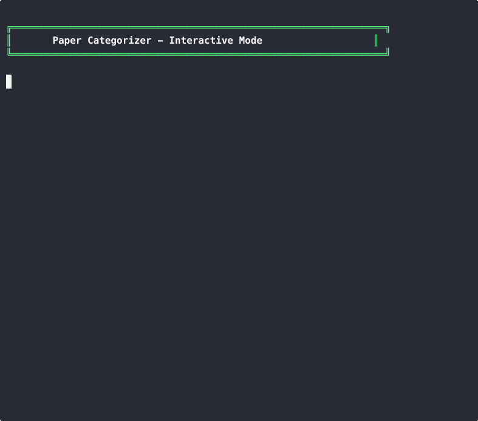
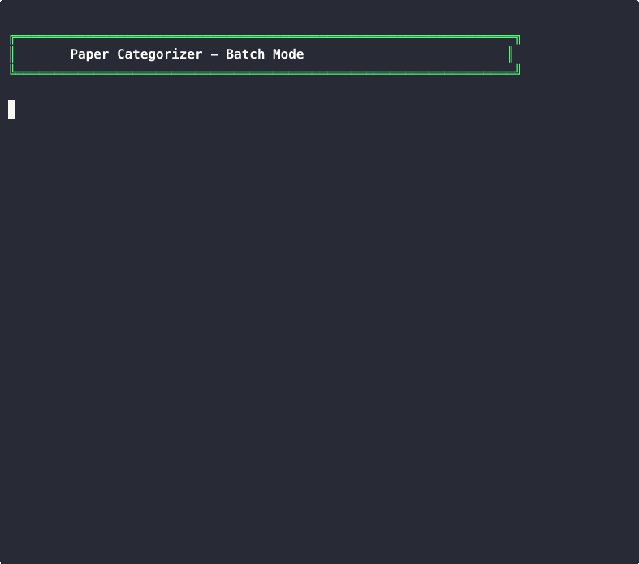

# Paper Categorizer

AI-powered academic paper organization tool. Automatically categorize your research papers using **Google Gemini**, **Anthropic Claude**, or **OpenAI**.

## Features

- **Multi-provider AI support** - Works with Gemini, Claude, or OpenAI
- **Interactive categorization** - Enter a paper title, get its category instantly
- **Batch processing** - Automatically sort PDFs from Inbox into category folders
- **Dynamic categories** - Fully customizable category hierarchy
- **Optional Zotero integration** - Sync categories to your Zotero library

---

## Demo

| Function | Description | Demo |
|----------|-------------|------|
| [1. Init](#1-initialize-the-system) | First-time setup, creates Inbox folder |  |
| [2. Interactive](#2-interactive-mode) | Enter title, get category instantly |  |
| [3. Batch](#3-batch-mode) | Process all PDFs in Inbox automatically |  |

---

## Quick Start

### 1. Initialize the System

> **What it does:** Creates your `Inbox/` folder and generates a `categories.json` template for customization.

<details>
<summary><strong>Click to see demo</strong></summary>


**What you'll see:**
- Inbox folder created at `~/Documents/Papers/Inbox/`
- Template `categories.json` generated
- Instructions for customizing your categories

</details>

```bash
cd ~/Documents/Papers
./paper_categorizer/run.sh --init
```

After initialization, edit `categories.json` to define your research areas:

```
1. Deep Learning
   1.1 Architectures & Models
   1.2 Training & Optimization
2. Traditional Machine Learning
   2.1 Supervised Learning
   2.2 Ensemble Methods
3. Large Language Models
   3.1 Model Architecture
   3.2 Evaluation & Benchmarks
4. AI Agents
   4.1 Agent Frameworks
   4.2 Agent Benchmarks
5. Natural Language Processing
6. Computer Vision
7. Reinforcement Learning
8. Uncategorized
```

---

### 2. Interactive Mode

> **What it does:** Categorize papers one at a time. Enter a title, get the category instantly with confidence score and reasoning.

<details>
<summary><strong>Click to see demo</strong></summary>


**What you'll see:**
- Enter paper title: "Attention Is All You Need"
- AI returns: **1.1 Architectures & Models** (Deep Learning)
- Confidence level and reasoning provided
- More examples: GPT-4, AgentBench, Random Forests

</details>

```bash
./paper_categorizer/run.sh --interactive
```

**Example session:**
```
Paper Title: Attention Is All You Need
Abstract (optional): [Enter]

Categorizing...

==================================================
Category: 1.1 Architectures & Models
Folder:   1. Deep Learning/1.1 Architectures & Models
Confidence: high
Reasoning: Seminal transformer architecture paper
==================================================
```

**Try these paper titles:**
| Paper Title | Category |
|-------------|----------|
| "Attention Is All You Need" | Deep Learning |
| "GPT-4 Technical Report" | Large Language Models |
| "AgentBench: Evaluating LLMs as Agents" | AI Agents |
| "Random Forests" | Traditional Machine Learning |

---

### 3. Batch Mode

> **What it does:** Automatically process all PDFs in your Inbox folder. Extracts titles from PDFs, renames files accordingly, categorizes each paper, and moves them to the appropriate folder.

<details>
<summary><strong>Click to see demo</strong></summary>


**What you'll see:**
- 3 papers in Inbox (LLM agent benchmark papers)
- Step 1: Auto-rename - extracts title from PDF and renames file (e.g., arXiv IDs → proper titles)
- Step 2: AI categorization with confidence scores
- Papers moved to `4. AI Agents/` subfolder
- Summary: 3 processed, 3 successful, 0 failed
- **Zotero integration: DISABLED** (shown in this demo)

</details>

```bash
# Drop papers into Inbox/
cp ~/Downloads/*.pdf Inbox/

# Process all papers
./paper_categorizer/run.sh --batch
```

**Example output (Zotero disabled):**
```
============================================================
Batch Processing - Inbox Papers (using gemini)
============================================================
Zotero integration: DISABLED

Found 3 PDF files to process.

----------------------------------------
Step 1: Auto-rename papers by extracted title
----------------------------------------
[1/3] 2308.03688.pdf... (needs title extraction)
  Title: AgentBench: Evaluating LLMs as Agents
  Renamed to: AgentBench-Evaluating-LLMs-as-Agents.pdf

[2/3] ToolLLM-Facilitating-LLMs-to-Master-Tools.pdf...
  OK Filename already matches title

----------------------------------------
Step 2: Categorizing papers
----------------------------------------
[1/3] AgentBench-Evaluating-LLMs-as-Agents.pdf...
  -> 4.2 Agent Benchmarks (high)
  Moved to: 4. AI Agents/4.2 Agent Benchmarks

[2/3] ToolLLM-Facilitating-LLMs-to-Master-Tools.pdf...
  -> 4.1 Agent Frameworks (high)
  Moved to: 4. AI Agents/4.1 Agent Frameworks

----------------------------------------
Processed: 3 papers
Successful: 3
Renamed: 1, Kept original: 2
```

---

## Installation

```bash
# 1. Clone or download the project
cd ~/Documents/Papers/paper_categorizer

# 2. Create virtual environment
python3 -m venv venv
source venv/bin/activate

# 3. Install dependencies
pip install -r requirements.txt

# 4. Configure API key
cp .env.example .env
# Edit .env and add your API key (at least one required):
#   GEMINI_API_KEY=your-key
#   ANTHROPIC_API_KEY=your-key
#   OPENAI_API_KEY=your-key

# 5. Configure Zotero (optional - OFF by default)
#    The tool works standalone without Zotero.
#    To enable Zotero integration, edit .env:
#      ZOTERO_ENABLED=true
#      ZOTERO_DB_PATH=~/Zotero/zotero.sqlite
#      ZOTERO_STORAGE_PATH=~/Zotero/storage

# 6. Initialize
cd ~/Documents/Papers
./paper_categorizer/run.sh --init
```

> **Note:** Zotero integration is **disabled by default**. You can use this tool to organize papers into folders without Zotero. Enable it only if you want to sync categories to your Zotero library.

---

## Configuration

### API Keys (.env)

```bash
# At least one API key is required
GEMINI_API_KEY=your-gemini-api-key
ANTHROPIC_API_KEY=your-anthropic-api-key
OPENAI_API_KEY=your-openai-api-key

# Default AI provider (optional)
DEFAULT_PROVIDER=gemini

# Zotero Integration (OFF by default)
ZOTERO_ENABLED=false    # Set to 'true' to enable Zotero sync
# ZOTERO_DB_PATH=~/Zotero/zotero.sqlite
# ZOTERO_STORAGE_PATH=~/Zotero/storage
```

### Categories (categories.json)

```json
{
  "categories": {
    "1": {
      "name": "1. Deep Learning",
      "description": "Neural networks and deep learning architectures",
      "keywords": ["neural network", "transformer", "CNN"],
      "subcategories": {
        "1.1": "1.1 Architectures & Models",
        "1.2": "1.2 Training & Optimization"
      }
    },
    "2": {
      "name": "2. Large Language Models",
      "description": "LLMs, GPT, language model research",
      "keywords": ["LLM", "GPT", "language model"],
      "subcategories": {
        "2.1": "2.1 Model Architecture",
        "2.2": "2.2 Evaluation & Benchmarks"
      }
    }
  }
}
```

---

## All Commands

| Command | Description |
|---------|-------------|
| `--init` | Initialize system and create Inbox folder |
| `--interactive`, `-i` | Interactive mode - categorize papers one by one |
| `--batch`, `-b` | Batch process all PDFs in Inbox |
| `--dry-run` | Preview batch processing without moving files |
| `--title`, `-t` | Categorize a single paper by title |
| `--list-categories`, `-l` | Show all categories |
| `--list-providers` | Show available AI providers |
| `--provider`, `-p` | Choose AI provider: `gemini`, `claude`, or `openai` |
| `--zotero-status` | Check Zotero integration status |

---

## Folder Structure

```
Documents/Papers/
├── Inbox/                      # Drop new PDFs here
├── Papers Auto Category/       # Auto-organized papers
│   ├── 1. Deep Learning/
│   │   ├── 1.1 Architectures & Models/
│   │   └── 1.2 Training & Optimization/
│   ├── 2. Large Language Models/
│   ├── 3. AI Agents/
│   └── ...
├── Papers_Summary.md           # Auto-generated summary
└── paper_categorizer/          # This tool
    ├── run.sh                  # Main entry point
    ├── categories.json         # Your categories
    └── .env                    # Your API keys
```

---

## Zotero Integration (Optional - OFF by Default)

> **Zotero is disabled by default.** The tool works perfectly standalone - it organizes your PDFs into category folders without needing Zotero. Only enable Zotero if you want to sync your paper categories to your Zotero library.

### To Enable Zotero

Edit `.env` and set:

```bash
ZOTERO_ENABLED=true
ZOTERO_DB_PATH=~/Zotero/zotero.sqlite
ZOTERO_STORAGE_PATH=~/Zotero/storage
```

### Check Status

```bash
./paper_categorizer/run.sh --zotero-status
```

### Important Notes

- **Close Zotero** before batch processing to avoid database locks
- Papers already in Zotero will have their collections updated
- New papers will be added to Zotero with PDF attachments

---

## Tips

1. **Auto-rename enabled** - Batch mode automatically extracts titles from PDFs and renames files (e.g., `2401.12345.pdf` → `Attention Is All You Need.pdf`)
2. **Zotero is OFF by default** - The tool works standalone without Zotero. To enable Zotero sync, set `ZOTERO_ENABLED=true` in `.env` (see [Zotero Integration](#zotero-integration-optional))
3. **Use dry run** - Preview changes before processing: `--batch --dry-run`
4. **Customize categories** - Edit `categories.json` to match your research areas
5. **Add keywords** - Help the AI categorize by adding relevant keywords to categories

---

## License

MIT License
